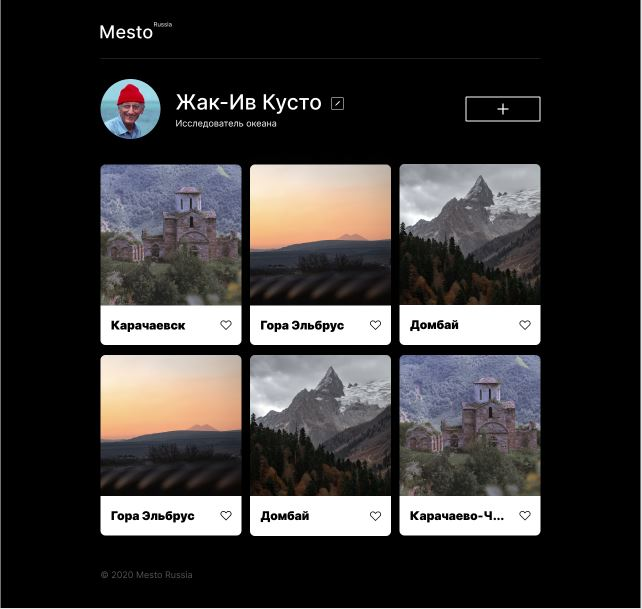

# Проект 4: Место

### Обзор
#### Это учебный сайт 
Предназначен для тренировки навыков java script. 

В проекте использованы технологии **java script**, **html5**, **css3**, **методология БЭМ**. Можно просто открыть в браузере). 

**Figma**

* [Ссылка на макет в Figma](https://www.figma.com/file/2cn9N9jSkmxD84oJik7xL7/JavaScript.-Sprint-4?node-id=0%3A1)

**Картинки**

[Ссылка на сайт](https://anna-test-2020.github.io/mesto-project/)